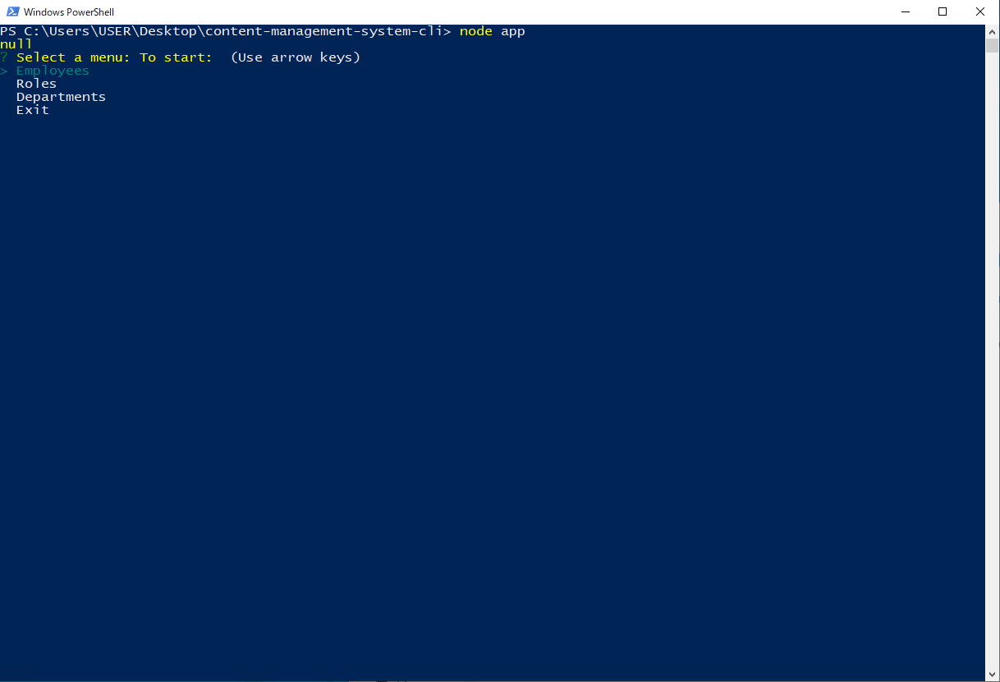

# Content Management System

## Table of Content: 
* [Deploy link](#Deploy-link)
* [Description](#Description)
* [Installation](#Installation)
* [User Guide](#User-Guide)
* [Third Party Package](#Third-party-package-used)
* [Contact](#Contact)

## Deploy Link
https://github.com/Aurorachama/

## Description 

This is a cli (commend line interface) application, a content management system to generate an employee database for a company

## Installation 
***This application relies on node.js as its run-time enviornment. Please install node.js before using this application***

***For information about node.js : [Node.js](https://nodejs.org/)***
* Clone this project using git clone <url> or Download ZIP, then use a command line to  run ``` npm i ``` to install necessary packages (inquirer)

## User Guide 

* Once installation is finished, user can type 
``` 
node app.js
```
or 
``` 
npm start
```
to run the code. 

* Then, prompt of menu listed as Employees, Roles and Departments (and Exit) option

* After that, users can have the choice to view, update, add or delete data by selected requirement

* After view, update, add or delete by the desired requirement, the data related to the query(fits the desired requirement) will shows up

* User will then been taken back to the first menu where they can do additional changes or use Exit option to close the application


## Third party package used

[Inquirer](https://github.com/SBoudrias/Inquirer.js)


## Screenshot
**Powershell is used to commence the application but other commend line works the same**


**Every question and the success message**


**The product and its path(inside the Output folder)**

## Demo
[](https://drive.google.com/file/d/1-x1BDy6rCSdkcbRTzMq5O7pRhC_M34sJ/view)
### Contact 

Github: [Aurorachama](https://github.com/Aurorachama)
