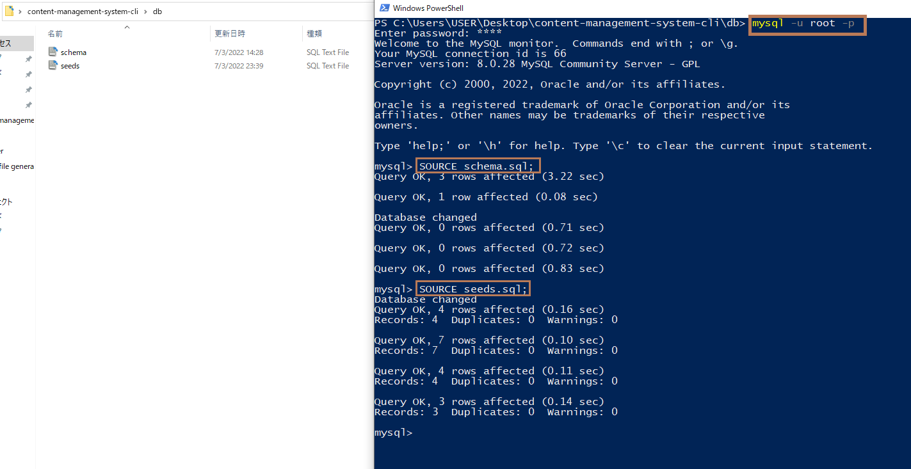
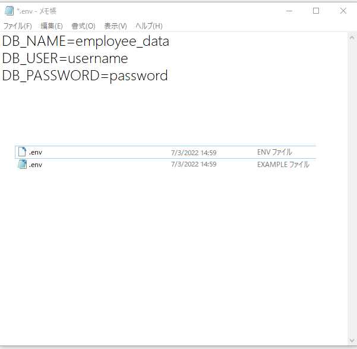
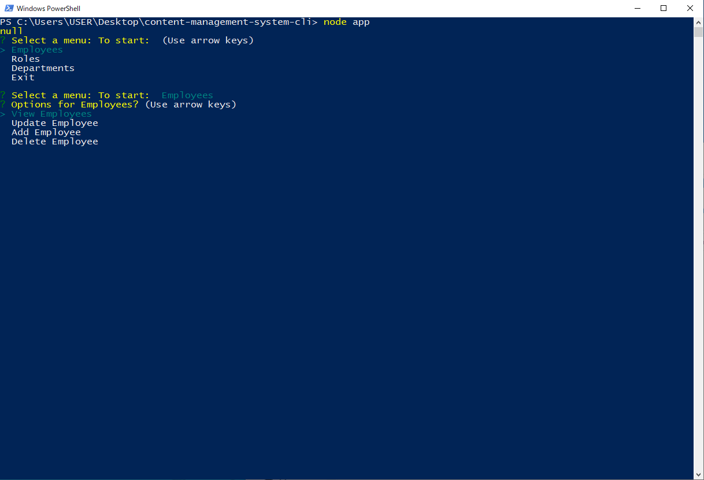
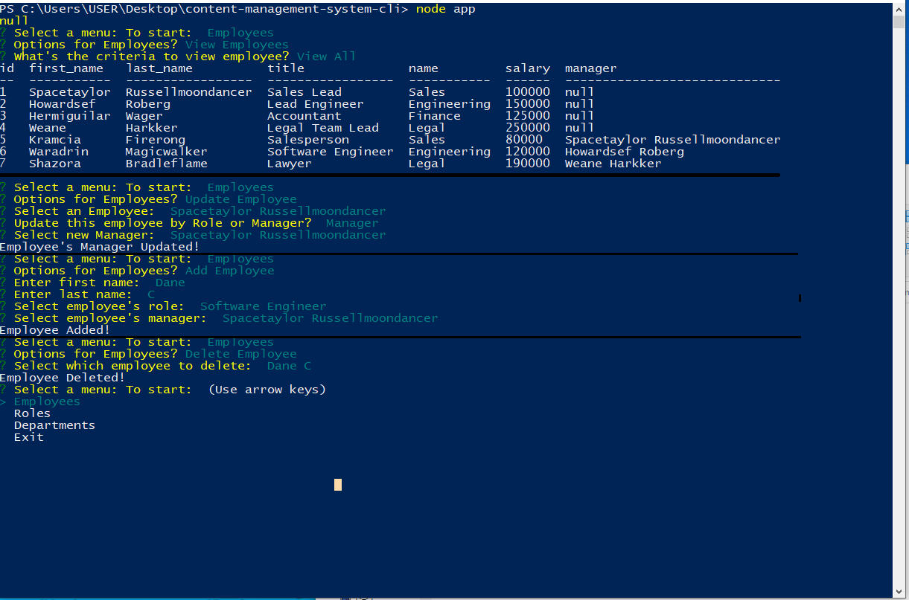

# Content Management System

## Table of Content: 
* [Deploy link](#Deploy-link)
* [Description](#Description)
* [Installation](#Installation)
* [Initialization Guide](#Initialization-Guide)
* [User Guide](#User-Guide)
* [Third Party Package](#Third-party-package-used)
* [Screenshot](#Screenshot)
* [Video Demo](#Video-demo)
* [Contact](#Contact)

## Deploy Link
https://github.com/Aurorachama/content-management-system-cli

## Description 

This is a cli (commend line interface) application, a content management system to generate an employee database for a company

## Installation 
### This application requires node.js and mysql
**MySQL will be used as the sql management system also known as dialect for the SQL query. Please install node.js before using this application**

***For information about MySQL : [Installation guide for MySQL](https://dev.mysql.com/doc/refman/8.0/en/installing.html)*** <br> <br>

***This application also relies on node.js as its run-time enviornment. Please install node.js before using this application***

***For information about node.js : [Node.js](https://nodejs.org/)***
* Clone this project using git clone <url> or Download ZIP, then use a command line to  run ``` npm i ``` to install necessary packages (inquirer)
---
<br>
<br>

## Initialization Guide
**Before using the application, initialization of database and connection is critical**

**MySQL Initialization**

[Installation guide for MySQL](https://dev.mysql.com/doc/refman/8.0/en/installing.html)

`After completion of installing MySQL and creating users, it is essential to initialize the database`

* Visit the subfolder 'db', open up a terminal (commend line interface). Type in 
```
mysql -u [replace with username] -p
```
<br>

* Then, enter the password for this user. After that, type in
```
SOURCE schema.sql;
```

* This will create a new SQL database name 'employee_data'

* You can rename the database name however you like by changing the 'employee_data' field in `schema.sql`,`seeds.sql` and `.env` file
---
* `seeds.sql` is some sample data for the database, it is your choice to insert them the your database or start from scratch If you want to use seeds.sql, simply type **SOURCE seeds.sql;** as you are initializing the database
---
### End goal of MySQL Initialization

* `the code you require to type is in brown branket` (You can restart at anypoint if you have done a mistake)

<br>
<br>

**.env file Initialization**

```
The second initialization is .env, .env is used to store your user credential and used to connect to the database by javascript so it is important to do so
```
* Go back to the root folder, you can see a file named `.env.EXAMPLE`

* You can choose any `text(.txt) editor` as program to open the `.env.EXAMPLE` file. Example would be `Notepad` (Included for Windows), `TextEdit` (Included for MacOS) or any Third party one like `Notepad++`

* This file is the format of the env file you would want to create

* You should change the `DB_USER` and `DB_PASSWORD` as the credential you use to login to MySQL

* You can either rename the file as .env or
* create a text file, Copy .env.EXAMPLE and save it new as a .env file
* **.env is the extension name of the file, if the text editor ask you about the extension of the file, leave it or `choose any file type in Notepad`**
---
### End goal of .env Initialization


---
---

**Initialization is done! You do not have to repeat the steps above unless you are re-deploying or changing user**
<br>
<br>
<br>
## User Guide
User then can type 
``` 
node app.js
```
or 
``` 
npm start
```
to run the code. 

* Then, prompt of menu listed as Employees, Roles and Departments (and Exit) option

* After that, users can have the choice to view, update, add or delete data by selected requirement

* After view, update, add or delete by the desired requirement, the data related to the query(fits the desired requirement) will shows up

* User will then been taken back to the first menu where they can do additional changes or use Exit option to close the application


## Third party package used
[Inquirer](https://github.com/SBoudrias/Inquirer.js) <br>
[Console Table](https://github.com/bahmutov/console.table) <br>
[Dotenv](https://github.com/motdotla/dotenv) <br>
[MySQL2](https://github.com/sidorares/node-mysql2) <br>


## Screenshot
**Powershell is used to commence the application but other commend line works the same** <br><br>
**Commencing the application**
 <br> <br>
**Types of sub-menu options(Using Employee sub-menu as a example)** <br> <br>
**Every type of operation from a sub-menu, (Using Employee sub-menu as a example)**


## Video Demo
[](https://drive.google.com/file/d/1BxQFb_PNbSDfG00Mk-TBF-HbNQiZJBdU/view)
### Contact 

Github: [Aurorachama](https://github.com/Aurorachama)
